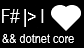
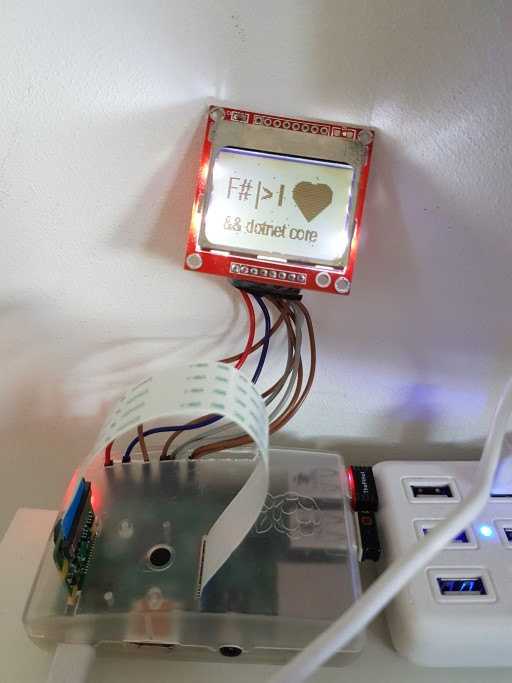
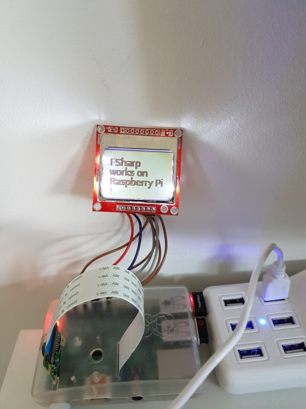

# RaspberryFsharp.Lcd5110

## Install Mono and .NET Core 2

Follow instructions of [Unosquare RaspberryIO](https://unosquare.github.io/raspberryio/) documentation

## Install libgdiplus

```shell
sudo apt-get install automake
sudo apt-get install libtool
sudo apt-get install libglib2.0-dev
sudo apt-get install libxrender-dev
sudo apt-get install libfontconfig1-dev
sudo apt-get install libpng12-dev
sudo apt-get install libgif-dev
sudo apt-get install libjpeg8-dev
sudo apt-get install libtiff5-dev
sudo apt-get install libexif-dev
sudo apt-get install gettext
```

## Hardware

You can find a Nokia 5110 LCD on [sparkfun](https://www.sparkfun.com/products/10168) or on [hackspark](https://hackspark.fr/fr/affichage/190-nokia-5110-lcd-screen.html).

## Wiring with your Raspberry Pi

You can follow instructions of this [article](https://www.algissalys.com/how-to/nokia-5110-lcd-on-raspberry-pi)

| Pin number    | GPIO          | LCD PIN |
| ------------- |:-------------:| -------:|
| 18            | GPIO 24       | RST     |
| 24            | SPI_CE0       | CE      |
| 16            | GPIO 23       | DC      |
| 19            | SPI_MOSI      | DIN     |
| 23            | SPI_SCLK      | CLK     |
| 1             | VCC 3.3V (+)  | VCC     |
| 11            | GPIO 17       | LIGHT   |
| 6             | GND (-)       | GND     |

## OS Setup

You need to enable SPI.
You can use `sudo raspi-config` as explained [here](https://www.raspberrypi-spy.co.uk/2014/08/enabling-the-spi-interface-on-the-raspberry-pi/)

## Code

I you followed the previous wiring instructions then you can use `ScreenContext.Default` to control your screen.

### Display a Bitmap

Your bitmap must have a width of 84 pixels and a height of 48 pixels.

Color are not interpreted.
If a pixel is not black, then it is displayed.
Images are encoded with one bit per pixel.
So a buffer of 504 bytes is sent to the screen.

Now we will display this bitmap.



Code is:

```F#
let logo = Bitmap.FromFile "logo2.bmp" :?> Bitmap
ScreenContext.Default
|> start (60uy, 4uy) // 60 is contrast, 4 is the bias
|> displayImage logo
|> ignore
```

Result is:



### Display a text

```F#
let text = 
    { Text.From "FSharp works on Raspberry Pi !"
        with Font = new Font("Roboto", 10.f)
    }
ScreenContext.Default
|> start (60uy, 4uy) // 60 is contrast, 4 is the bias
|> displayText text
|> ignore
```



Example program is [here](RaspberryFsharp.Lcd5110.Sample/Program.fs)

## Run example

### Build and publish

#### Solution 1

Build project with
```
cd RaspberryFsharp.Lcd5110.Sample
dotnet build
dotnet publish -r linux-arm
```

Upload manually.

#### Solution 2

You can also use `sshdeploy` like

`dotnet sshdeploy push -w youpassword -h yourip`

You also edit the project to [store informations](https://github.com/unosquare/sshdeploy#xml-tags)

I made a [pull request](https://github.com/unosquare/sshdeploy/pull/8) to add support of FSharp project.
I am now waiting for the new version a the [NuGet](https://www.nuget.org/packages/SSHDeploy/)


### Run program on your Raspberry Pi

```
chmod +x RaspberryFsharp.Lcd5110.Sample
sudo ./RaspberryFsharp.Lcd5110.Sample
```
